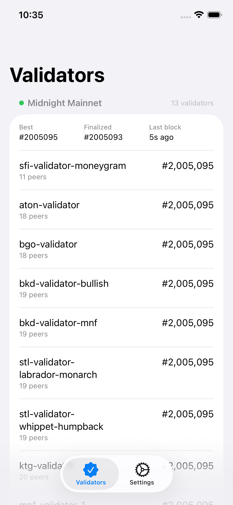
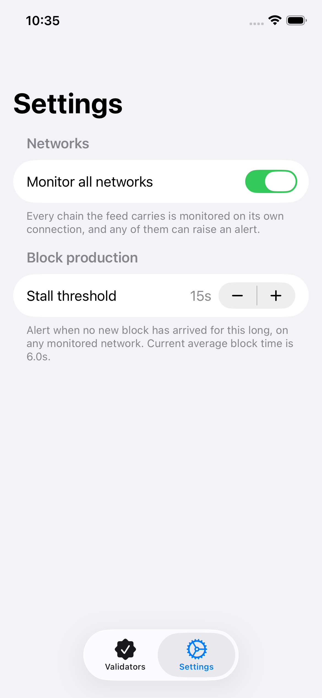

# Midnight Telemetry

iOS app that monitors Midnight network validators in real time. It connects to the public Substrate telemetry feed, shows live chain and node health, and sends local notifications when blocks stall or validators fall behind.

<p align="center">
  
  &nbsp;
  
</p>

## Features

- **Live validator list** — name, peer count, and best block for each node on Midnight Mainnet
- **Chain stats** — best / finalized height and time since the last block
- **Stall alerts** — local push notification when no new block arrives within a configurable threshold
- **Lag detection** — validators trailing the tip by more than a couple of blocks are highlighted
- **Multi-network** — optionally monitor every chain the feed announces, each on its own connection

## Architecture

All networking, feed parsing, state, and alert logic lives in Rust (`rust/`). SwiftUI only renders the UI and posts `UNUserNotificationCenter` notifications. The Rust core is exposed to Swift via [UniFFI](https://mozilla.github.io/uniffi-rs/) as an XCFramework.

```
rust/          UniFFI crate (telemetry client, health checks)
ios/           SwiftUI app + Generated bindings + XCFramework
```

Feed: `wss://telemetry.shielded.tools/feed/` (same wire protocol as telemetry.polkadot.io).

## Requirements

- macOS with Xcode
- Rust toolchain (`rustup`) with iOS targets
- Apple Silicon or Intel Mac (both simulator slices are built)

## Build

1. **Build the Rust core and regenerate Swift bindings:**

   ```bash
   ./rust/scripts/build-ios.sh
   ```

   This produces `ios/Frameworks/RustCoreFFI.xcframework` and updates `ios/MidnightTelemetry/Generated/`.

2. **Open and run the app:**

   ```bash
   open ios/MidnightTelemetry.xcodeproj
   ```

   Select an iOS Simulator (or a device) and run the `MidnightTelemetry` scheme.

## Screenshots

| Validators | Settings |
| --- | --- |
| Live mainnet tip, finalized height, and per-validator peers / block | Toggle multi-network monitoring and the block-stall threshold |
|  |  |
